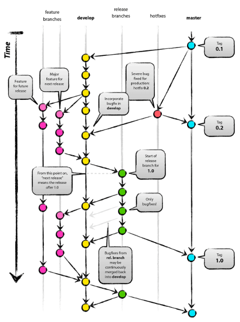

### 一、项目目录结构
    --  heathy-server  
        | -- heathy-server-api  
        | -- heathy-server-bean  
        | -- heathy-server-zuul  
        | -- heathy-server-config-github  
        | -- heathy-server-eureka  
        | -- heathy-server-dashboard  
        | -- heathy-server-redis  
        | -- heathy-server-kafka-websocket  
        
其中heathy-server-bean不需要启动类以及yml配置；  
  
### 二、服务间调用问题：
	* 服务之间可以通过Maven引入依赖。
	* 在未来，有些服务需要单独划分独立部署在服务器诸如zuul网关路由以及eureka、dashboard健康仪表盘。  
	在这些模块之间通信使用Rest接口OpenFeign方式调用。  
  
### 三、Git工作流遵从GitFlow工作流 如下图：


### 四、日志
框架采用Slf4j日志门面，Logback为日志实现

### 五、接口文档
```heathy-server-api```支持Swagger接口文档  
```Url:host:port/swagger-ui.html```

### 六、服务监控
API使用hystrix-dashboard服务及流量监控
```http://host:port/hystrix```

### 七、任务调度框架
本项目告警日志由quartz任务调度框架  
官网地址：http://www.quartz-scheduler.org/  
SpringBoot对quartz支持：  
https://docs.spring.io/spring-boot/docs/2.1.14.BUILD-SNAPSHOT/reference/html/boot-features-quartz.html
```
quartz默认配置：
  Scheduler class: 'org.quartz.core.QuartzScheduler' - running locally.
  NOT STARTED.
  Currently in standby mode.
  Number of jobs executed: 0
  Using thread pool 'org.quartz.simpl.SimpleThreadPool' - with 10 threads.
  Using job-store 'org.quartz.simpl.RAMJobStore' - which does not support persistence. and is not clustered.
``` 
- 出于性能考虑项目中替换了quartz默认的c3p0单线程连接池
- 因为项目定时任务相对简单，只是收集ERROR级别日志定期发送邮件
因此没有配置集群。  
  
### 八、数据库连接池：Alibaba/Druid
Github地址：https://github.com/alibaba/druid  
在本项目中运用：
-   连接池监控
-   SQL防注入
```
监控页面：http://ip:port/druid/index.html
```  


### 九、日志配置级别告警
相关配置在```heathy-server-api```中```application.yml```中目前只负责ERROR Leavel入表  
下面为可配置项：  
-   触发器CORN：目前配置为每隔一小时发送邮件
-   日志级别：
包括邮件发送级别（注：此处配置的邮件级别严格按照Log日志级别优先级配置，比如
配置文件中配置的为DEBUG级别，那么优先级比DEBUG高的都符合邮件告警要求）
-   详细日志查看<A>标签回调服务，项目更换域名后，需要修改此处地址，否则邮件中无法进行服务回调