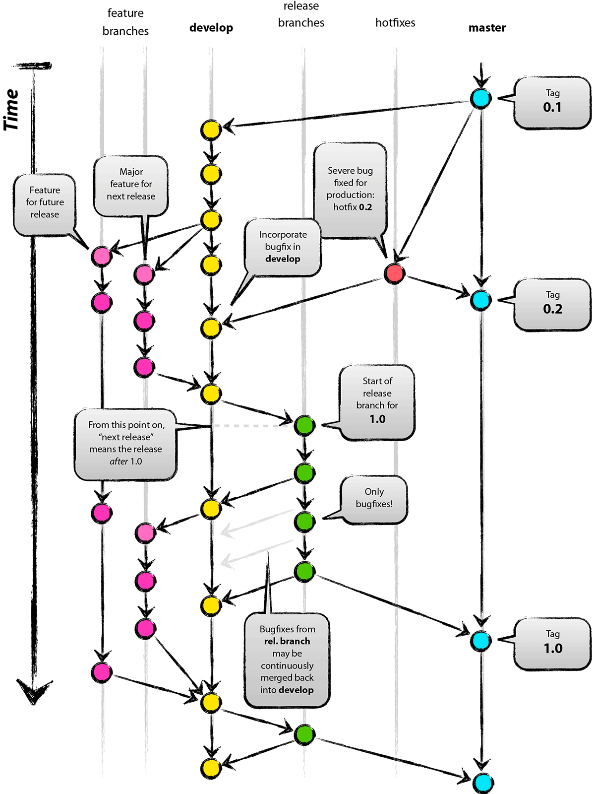

### 一、项目目录结构
    --  heathy-server  
        | -- heathy-server-api  
        | -- heathy-server-bean  
        | -- heathy-server-zuul  
        | -- heathy-server-config-github  
        | -- heathy-server-eureka  
        | -- heathy-server-dashboard  
        | -- heathy-server-redis  
        | -- heathy-server-kafka-websocket  
        
其中heathy-server-bean不需要启动类以及yml配置；  
  
### 二、服务间调用问题：
	* 服务之间可以通过Maven引入依赖。
	* 在未来，有些服务需要单独划分独立部署在服务器诸如zuul网关路由以及eureka、dashboard健康仪表盘。  
	在这些模块之间通信使用Rest接口OpenFeign方式调用。  
  
### 三、Git工作流遵从GitFlow工作流 如下图：
